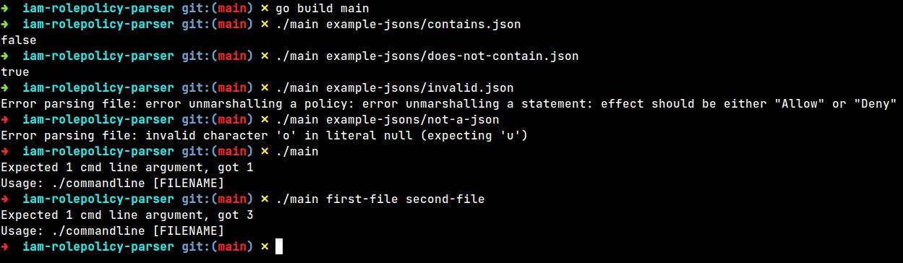

# AWS::IAM::RolePolicy parser
This project provides an easy way to check whether the Resource value of a role policy statement is a wildcard.

Works with AWS::IAM::RolePolicy versions "2012-10-17" and "2008-10-17".
#### Note: This is done as a part of a coding challenge for a job application of an undisclosed company

## Function type signature
The `IamRolePolicy` type and the method below are defined in the `iamrolepolicyparsing` package.
The method checks whether in any statement in the policy, the Resource value of a role policy statement is a wildcard and returns false if it is.
```go
func (p *IamRolePolicy) NoStatementHasWildcardResource() bool
```
## Code example (excerpt from commandline.go)
```go
iamRolePolicy := iamrolepolicyparsing.IamRolePolicy{}
err = iamRolePolicy.UnmarshalJSON(json)
if err != nil {
    fmt.Println("Error parsing file:", err.Error())
    os.Exit(1)
}

println(iamRolePolicy.NoStatementHasWildcardResource())
```

## You can use the method directly in your code, or you can compile and run the program from the command line with a file name as an argument.
### Dependencies:
- Go 1.22
### To compile:
```bash
go build main
```
### To run:
```bash
./main json-filename
```
### There are example JSON files in the `./example-jsons` directory
### Example usage:


## Disclaimers
The JSON verification in this project is limited and does not include the following structures:
* action_string
* sid_string
* principal_id_string
* condition_type_string
* condition_key_string
* condition_value_string
 
As per [the AWS::IAM::RolePolicy grammar documentation](https://docs.aws.amazon.com/IAM/latest/UserGuide/reference_policies_grammar.html).
